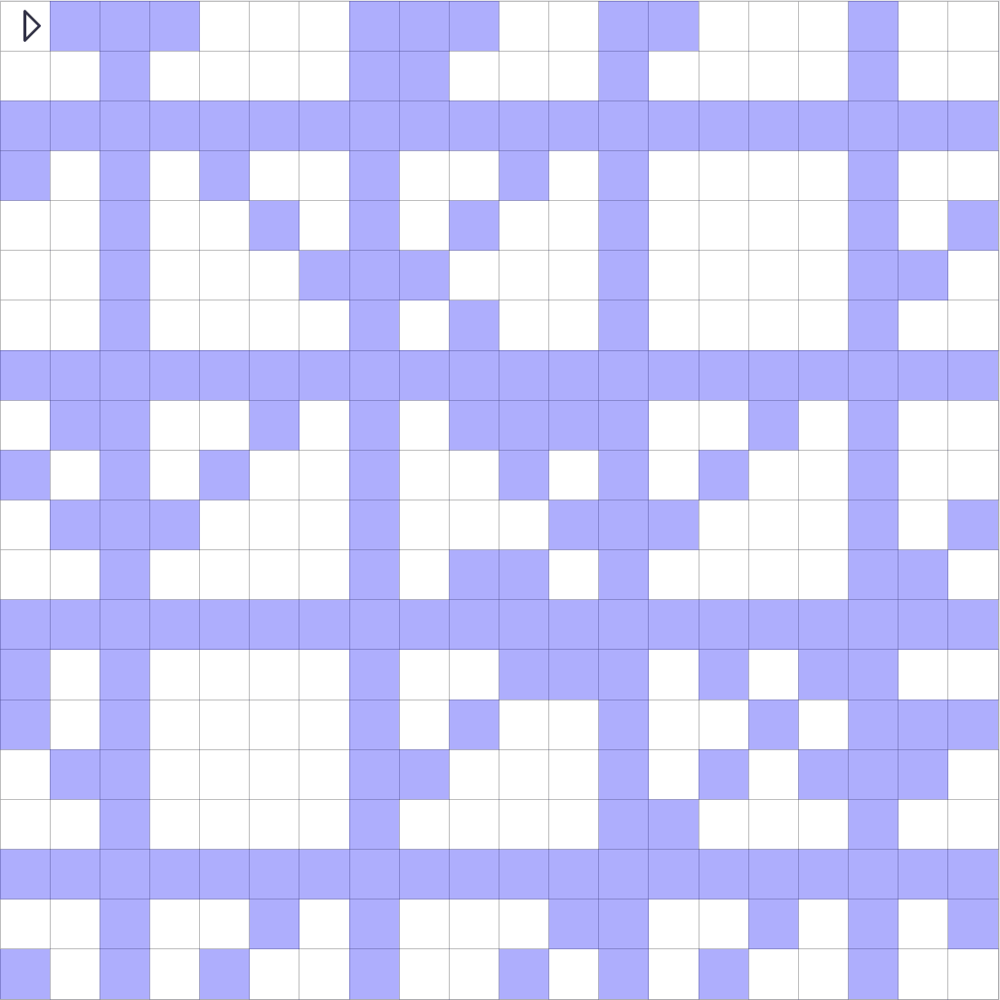

# MM140

## Links

[Problem Statement](https://www.topcoder.com/challenges/d6b59637-343d-47b3-ac1e-8b45b2416b09?tab=details)

[Final Solution](./src/cpp/RobotPainter.cpp) - My final submission

- [MM140](#mm140)
  - [Links](#links)
  - [日本語](#日本語)
    - [問題概要](#問題概要)
    - [解概略](#解概略)
    - [解法](#解法)
      - [step 1/2 候補の列挙](#step-12-候補の列挙)
      - [step 2/2 集合被覆問題を解く](#step-22-集合被覆問題を解く)
    - [結果](#結果)
    - [駄目だった方針](#駄目だった方針)
    - [感想](#感想)
  - [ENGLISH](#english)
    - [Problem Summary](#problem-summary)
    - [Solution Summary](#solution-summary)
    - [Solution](#solution)
      - [Step 1/2 Enumerate candidates](#step-12-enumerate-candidates)
      - [Step 2/2 Solve the set covering problem](#step-22-solve-the-set-covering-problem)
    - [Result](#result)
    - [Failed Policy](#failed-policy)
    - [Impressions](#impressions)

## 日本語

以下、日本語による参加記です

### 問題概要

N*Nの一部が青く塗られたグリッドが与えられる  
ペンを持つロボットを以下のコマンドで操作する  

| 操作   | 概要                          | コスト    |
| ------ | ----------------------------- | --------- |
| U or D | ペンの上げ下げ                | 1         |
| F or B | 直線方向に[0,N)マス移動       | 1         |
| R or L | ±45度回転                     | 1         |
| J      | 任意マスにジャンプ            | JC([2,5]) |
| FOR    | FOR ENDで囲んだ範囲を繰り返す | FC([2,5]) |

これらのコマンドを用いてロボットを操作し、入力のように画像を塗れ

### 解概略

seed2


### 解法

#### step 1/2 候補の列挙

いくつかの基本的なパターンを列挙して、それらを候補としました  
以下のパターンは、さらにどこからどの向きでスタートするのか(sr,sc,sd)の情報も含みます。

1. FOR RF

   ```txt
   FOR
       R 3 (i.e. R R R)
       F 6
   END
   ```

   $N\leq12$ の時はFOR RFRFと、RFをもう一つ追加しました。

   例: seed1
   

   状態数としては、 $O(N^3dirLen^2loopLen)$ です。  
   ( $dirLen:=8,loopLen:=9$ )

2. RF

   ```txt
   R 3 (i.e. R R R)
   F 6
   ```

   状態数としては $O(N^3dirLen^2)$ です。

3. FOR FJ

   ```txt
   FOR
       F 6
       J 1 2
   END
   ```

   例: seed61
   

   状態数としては $O(N^5loopLen)$ です。

愚直にこれらを全て列挙すると、時間がかかりすぎてしまいます。  
なので、適切にこれらを枝刈りすることで、5sec以内に収めています。

具体的な高速化の手法は以下の通りです。

- 初期地点は必ず青い点にする
- loop回数は2からスタートして、failが発生した時点で打ち切る
- 直線を塗る際は最長のものを選ぶようにする(ただし、ループするような場合は別で考慮する)
- 簡易的なチェックを行い、シミュレーションをする前に失敗が発生する恐れがないか確認する
- bitsetでシミュレーションを高速化
- 上位互換が存在するような要素は削除する (ただし、全て調べるとTLEするので、後述の操作内で採用された候補の下位互換のみを調べる)

---

#### step 2/2 集合被覆問題を解く

以上で列挙した候補の内、どれを選ぶべきかということは、簡易的には[重み付き集合被覆問題](https://ja.wikipedia.org/wiki/%E9%9B%86%E5%90%88%E8%A2%AB%E8%A6%86%E5%95%8F%E9%A1%8C)になります。

各候補がいくつかの塗れる点の集合を持っていて、かつ、各塗られるべき点は最低1度は塗られる必要がある(一度は被覆される必要がある)ということから、この問題に対応しています。

(私は最初、この問題を最小費用流で解けると勘違いしていましたが、実はNP困難でした)

この問題は様々なヒューリスティックが知られているようですが、費用対効果に注目した貪欲法だけである程度の近似保証が得られるので、この方法をメインに考えていくことにしました。

[参考1](https://img.atwiki.jp/yappy0625/attach/11/14/soturon.pdf)  
[参考2](https://www.kurims.kyoto-u.ac.jp/~kyodo/kokyuroku/contents/pdf/1114-22.pdf)

今回は被覆を一つ選ぶ毎に、ジャンプをする必要がある(i.e. 追加のコストが発生する)ので、費用を少し上乗せするようにして選んでいくと改善しました。

```cpp
while (painted_num < TARGET_NUM) {
    int best_idx=-1;
    double best_cost_effectiveness=0.0;

    for (int i = 0; i < int(candidates.size()); i++) {
        const CandInfo& cand = candidates[i];

        // コマンド自体のコストと、コマンド間の移動に伴うコストの合計
        double cost = cand.commands_cost + cand.move_cost;
        
        // この候補が被覆する点の内、まだ塗られていない点の数をbitsetで求める
        double effect = (cand.painted_tiles & already_painted).count();

        // 乱択をするので、ブレを発生させる
        cost = powf(cost, random_cost_e);
        effect = powf(effect, random_effect_e);
        
        // 最大の費用対効果となる候補を選ぶ
        if (chmax(best_cost_effectiveness, effect / cost)) {
            best_idx = i;
        }
    }

    // 貪欲に選ばれた候補を採用していく
    adopt_the_cand(candidates[best_idx]);
}
```

このループを制限時間まで試し続けて、最良のものを解として出力しています。

---

私の方針としては以上です。

### 結果

| seed | score |
| ---- | ----- |
| 1    | 9.0   |
| 2    | 267.0 |
| 3    | 116.0 |
| 4    | 63.0  |
| 5    | 16.0  |
| 6    | 39.0  |
| 7    | 148.0 |
| 8    | 103.0 |
| 9    | 76.0  |
| 10   | 50.0  |

### 駄目だった方針

最後の方にJが多発するということが起こりがちなので、それをなんとかしたかったのですが、あまりうまく行きませんでした。

01bfsやbitDPなどの手法で残りの点を巡回しようと思ったのですが、実装があまりに大変な上、点がばらけすぎているので、あまり効果が望めませんでした。

例:seed3


ペンを一切上げていないので、その辺りを工夫すれば良かったのかも知れません。

### 感想

最初は[HACK TO THE FUTURE 2022](https://atcoder.jp/contests/future-contest-2022-final-open)に近いのかなという印象を受けましたが、ところどころ異なる印象を受けました。

AHC014があるので最初の2日間だけの参加になりましたが、面白かったです。

お読みいただきありがとうございました。

## ENGLISH

The following is a note of my approach.

### Problem Summary

Given a N*N grid which is partially painted blue.  
A robot with a pen can be operated with the following commands.  

| operation | abstract                                      | cost      |
| --------- | --------------------------------------------- | --------- |
| U or D    | pen up and down                               | 1         |
| F or B    | move [0,N) cells in a straight line direction | 1         |
| R or L    | rotate ±45 degrees                            | 1         |
| J         | Jump to any cell                              | JC([2,5]) |
| FOR       | execute the commands between FOR and END      | FC([2,5]) |

Manipulate the robot with these commands and paint the image as shown in the input.

### Solution Summary

seed2


### Solution

#### Step 1/2 Enumerate candidates

I enumerated some basic patterns and made them candidates.  
The following patterns additionally include information on where and in which direction to start (sr,sc,sd).

1. FOR RF

   ```txt
   FOR
       R 3 (i.e. R R R)
       F 6
   END
   ```

   when $N\leq12$ , I used FOR RFRF pattern instead of this.

   Example: seed1
   

   The number of states is $O(N^3dirLen^2loopLen)$.  
   (where $dirLen:=8,loopLen:=9$ )

2. RF

   ```txt
   R 3 (i.e. R R R)
   F 6
   ```

   The number of states is $O(N^3dirLen^2)$.

3. FOR FJ

   ```txt
   FOR
       F 6
       J 1 2
   END
   ```

   Example: seed61
   

   The number of states is $O(N^5loopLen)$.

If I enumerate all these candidates, it would take too much time.  
Therefore, by pruning them appropriately, I can keep the time within 5 seconds.

The specific speed-up method is as follows.

- The initial point(sr,sc) is always a blue point.
- Start the number of loops at 2 and terminate when a fail occurs.
- When painting a straight line, choose the longest one (but consider looping separately).
- Do simple checks to make sure there is no risk of failure before simulation
- speed up simulation by using bitset
- Remove elements that have upper compatible (However, checking all of them will result in TLE. Thus, I checked only backward compatible of the candidates adopted in the step described below).

---

#### Step 2/2 Solve the set covering problem

Deciding which candidates to use for painting the image is somewhat similar to the [weighted set covering problem](https://ja.wikipedia.org/wiki/%E9%9B%86%E5%90%88%E8%A2%AB%E8%A6%86%E5%95%8F%E9%A1%8C ).

Each candidate has a set of several points to paint, and each blue point needs to be painted at least once (in other words, needs to be covered at least once).

(I initially mistakenly thought that this problem could be solved with [mincost flow](https://atcoder.github.io/ac-library/production/document_ja/mincostflow.html), but it turned out this problem was NP-hard)

Various heuristics seem to be known for this problem.  
Especially, the greedy method, which focuses on cost-effectiveness, provides some approximation guarantees, so I decided to use this method as the main one.

[Reference1](https://img.atwiki.jp/yappy0625/attach/11/14/soturon.pdf)  
[Reference2](https://www.kurims.kyoto-u.ac.jp/~kyodo/kokyuroku/contents/pdf/1114-22.pdf)

In this MM Problem, every time I select one covering, the robot needs to make a jump (i.e. incurring an additional cost), so I improved the selection by adding a little extra cost.

```cpp
while (painted_num < TARGET_NUM) {
    int best_idx=-1;
    double best_cost_effectiveness=0.0;

    for (int i = 0; i < int(candidates.size()); i++) {
        const CandInfo& cand = candidates[i];

        // Sum of command cost and the cost associated with moving between commands
        double cost = cand.commands_cost + cand.move_cost;
        
        // Find the number of points covered by this candidate that have not yet been painted by using bitset
        double effect = (cand.painted_tiles & already_painted).count();

        // add extra cost with randomness
        cost = powf(cost, random_cost_e);
        effect = powf(effect, random_effect_e);
        
        // Select the candidate with the greatest cost-effectiveness.
        if (chmax(best_cost_effectiveness, effect / cost)) {
            best_idx = i;
        }
    }

    // Greedily adopt selected candidates.
    adopt_the_cand(candidates[best_idx]);
}
```

I looped those procedures until the time limit, and the best one is the solution.

---

That is all for my approach.

### Result

| seed | score |
| ---- | ----- |
| 1    | 9.0   |
| 2    | 267.0 |
| 3    | 116.0 |
| 4    | 63.0  |
| 5    | 16.0  |
| 6    | 39.0  |
| 7    | 148.0 |
| 8    | 103.0 |
| 9    | 76.0  |
| 10   | 50.0  |

### Failed Policy

I wanted to do something about a lot of Js at the end of the commands, but my attempt didn't work well.

I tried to solve this by a method such as 01bfs or bitDP, but it was too hard to implement and the left points were too scattered.

Example: seed3


I did not raise the pen at all, so perhaps I should have worked around that.

### Impressions

At first I had the impression that this problem was similar to [HACK TO THE FUTURE 2022](https://atcoder.jp/contests/future-contest-2022-final-open), but it was different in some ways.

I only participated the first two days because of AHC014, but it was very interesting.

Thank you for reading.
